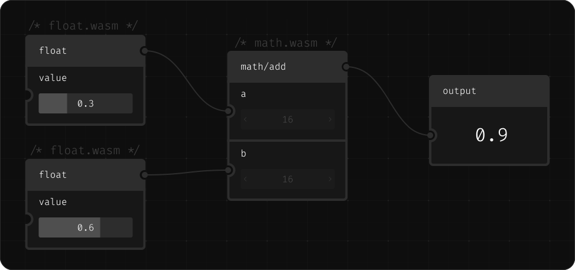

Nodarium

<div align="center">

<a href="https://nodes.max-richter.dev/"><h2 align="center">Nodarium</h2></a>

  <p align="center">
    Nodarium is a WebAssembly based visual programming language.
  </p>

  

</div>

Currently this visual programming language is used to develop <https://nodes.max-richter.dev>, a procedural modelling tool for 3d-plants.

# Table of contents

- [Architecture](./docs/ARCHITECTURE.md)
- [Developing](#developing)
- [Roadmap](#roadmap)

# Developing

### Install prerequisites

- [Node.js](https://nodejs.org/en/download)
- [pnpm](https://pnpm.io/installation)
- [rust](https://www.rust-lang.org/tools/install)

### Install dependencies

```bash
pnpm i
```

### Build the Nodes

```bash
pnpm build:nodes
```

### Start the dev server

```bash
cd app
pnpm dev
```

### [Now you can create your first node 🤓](./docs/DEVELOPING_NODES.md)

# Roadmap
